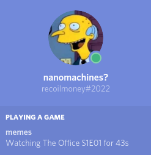

# VLC Discord RPC

[](https://github.com/qwertyquerty/pypresence)

I had this idea to integrate Discord rich presence into VLC so that the rest of the server can see what you're watching. I hacked this together in a few hours (**major** emphasis on "hacked"), unsure if I plan to improve it.

It's really just a basic wrapper around VLC using the [VLC bindings for Python](https://pypi.org/project/python-vlc/). Key listeners provided by [pynput](https://pypi.org/project/pynput/) control a timer that updates the presence using [pypresence](https://qwertyquerty.github.io/pypresence/html/index.html). It displays the show that's playing and the season/episode number (given that the filename is in the correct format).

```
./vlcrpc.py The-Office_1-01.avi
``` 

shows:


